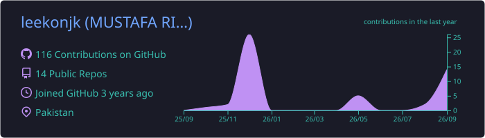
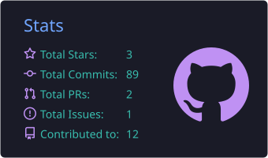
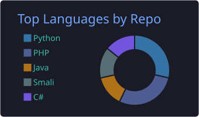

<div align="center">


<br/>

[](https://leekon.studio)
[](https://www.linkedin.com/in/mustafa-riaz-351569298/)
[](mailto:mustafariaz2005@gmail.com)
[](https://github.com/leekonjk)


</div>

---

## 🧑‍💻 `whoami`

```csharp
public class MustafaRiaz : GameDeveloper
{
    public string Handle     => "leekonjk";
    public string University => "COMSATS University Islamabad, Wah Campus";
    public string Degree     => "BS Software Engineering (Final Year)";
    public string Based      => "Wah Cantt, Pakistan 🇵🇰";

    public string[] Engines  => { "Unity" };
    public string[] Focus    => { "Co-op Multiplayer", "Mobile Games", "Game Feel & Polish" };
    public string   Studio   => "leekon.studio — freelance";

    public void Learn() => TryIt().BreakIt().FigureItOut();   // trial & error > docs
}
```

---

## 🎮 Games I'm Building

<table>
<tr>
<td width="50%" valign="top">

### ⚔️ Layerfall
**Final Year Project** · with Mohees Ahmed

A co-op **extraction adventure** for up to **4 players** — no swords, no guns. You survive using **ancient artifacts and tools** deep inside layered dungeons.

`Unity 2022 LTS` `URP` `Unity Relay` `C#`

- 🟢 Dungeon environment & lighting
- 🟢 Online co-op via Relay
- 🟡 Artifact systems & level design
- 🟡 Stylized character art pass

</td>
<td width="50%" valign="top">

### 🧟 Survival
**Mobile** · Solo

An **isometric 3D zombie survival** game built for phones — scavenge, hold out, don't get bitten.

`Unity` `C#` `Android`

- 🟢 Core concept & isometric setup
- 🟡 Zombie AI & combat
- 🟡 Mobile controls & performance
- ⬜ Google Play release

</td>
</tr>
<tr>
<td width="50%" valign="top">

### ⏱️ Countdown
**Game Jam** · theme: *"countdown"*

You have **one break**. Eat, hit the toilet, get back to class — while teachers chase you and friends won't stop talking. **Mash buttons** to escape conversations.

`Unity` `URP` `Cinemachine` `TMP`

</td>
<td width="50%" valign="top">

### 🤖 AI Dev Harness
**Side Project** · Tooling

A personal **agentic coding harness** on the Claude Agent SDK — interactive CLI plus a **headless parallel task runner** for my own projects.

`Python` `Claude Agent SDK`

</td>
</tr>
</table>

<details>
<summary><b>📦 Earlier projects</b></summary>
<br/>

| Project | Stack | What it is |
|---|---|---|
| 🏃 Temple Run Clone | Unity · C# | 3D endless runner with procedural chunk generation, obstacles, coins & score UI |
| 🎓 CUI Online Platform | C# · .NET | Full-stack university platform with backend & database |
| 🧠 AI Study Buddy | Flutter · Dart | AI-powered study assistant app |
| 📱 Flutter Multi-Page App | Flutter · Firebase | Multi-page app with REST API, animations & themes |
| 🌐 leekon.studio | Node · Vercel | My freelance portfolio site, live on a custom domain |

</details>

---

## 🛠️ Toolbox

<div align="center">

**Game Dev**<br/>


**Apps & Web**<br/>


**Tools**<br/>


</div>

---

## 📈 Stats

<div align="center">
  
  <br/>
  
  
  <br/>
  
</div>

---

<div align="center">

### 🐍 Watch my contributions get eaten

<picture>
  <source media="(prefers-color-scheme: dark)" srcset="https://raw.githubusercontent.com/leekonjk/leekonjk/output/github-snake-dark.svg" />
  <source media="(prefers-color-scheme: light)" srcset="https://raw.githubusercontent.com/leekonjk/leekonjk/output/github-snake.svg" />
  
</picture>

<br/><br/>

> *"Every great game started as a broken prototype."*


</div>
